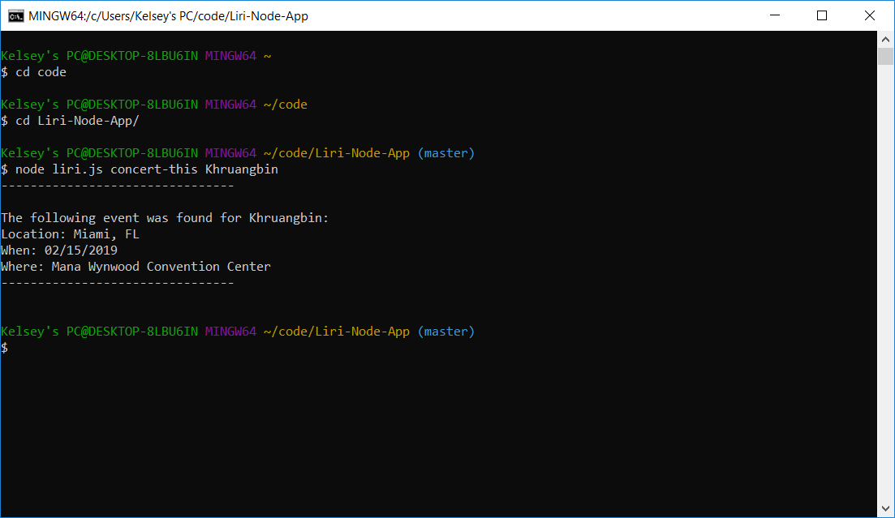
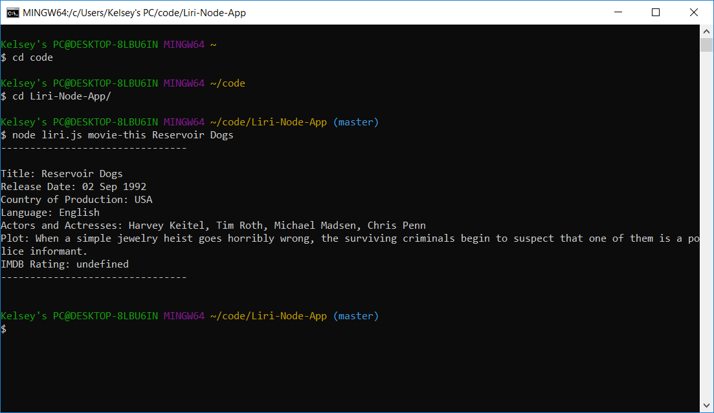

# Liri-Node-App
**CLI Language Interpretation and Recogniction Interface**

## Introduction
LIRI is a Language Interpretation and Recognition Interface. LIRI uses command line and node to take in parameters and give the user back requested data.

### Commands
**node liri.js**

**Followed by:**
        _1.concert-this_
        _1.movie-this_
        _1.spotify-this-song_

#### Example for concert-this command
_node liri.js concert-this <'band name'>_

#### Example for movie-this command
_node liri.js movie-this <'movie name'>_

#### Example for spotify-this-song command
_node liri.js spotify-this-song <'song name'>_

##### Packages
**1.NPM Packages Used**
    1. Spotify
    1. Moment
    1. Axios
    1. Dotenv

*To install these packages run the following commands in your terminal
    1.npm install spotify
    1.npm install moment
    1.npm install axios
    1.npm install dotenv

    
